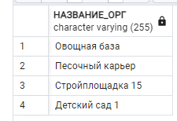

# Уровень 1
## 1 задание
```sql
CREATE TABLE Место_Работы (
ИДЕНТИФИКАТОР VARCHAR(5) PRIMARY KEY,
НАЗВАНИЕ_ОРГ VARCHAR(255),
АДРЕС_РАБОТЫ VARCHAR(255),
ЛЬГОТА DECIMAL(5, 2)
);
```
```sql
CREATE TABLE Автопредприятие (
ИДЕНТИФИКАТОР VARCHAR(5) PRIMARY KEY,
НАЗВАНИЕ VARCHAR(255),
РАСПОЛОЖЕНИЕ VARCHAR(255),
КОММИССИОННЫЕ DECIMAL(5, 2)
);
```

```sql
CREATE TABLE Техника (
ИДЕНТИФИКАТОР VARCHAR(5) PRIMARY KEY,
ТИП VARCHAR(255),
АДРЕС_ГАРАЖА VARCHAR(255),
МАКС_КОЛ_ВО INTEGER,
СТОИМОСТЬ_ЗАКАЗА DECIMAL(10, 2)
);
```
```sql
CREATE TABLE Заказ (
НОМЕР VARCHAR(5) PRIMARY KEY,
ДАТА VARCHAR(20),
МЕСТО_РАБОТЫ VARCHAR(5),
АВТОПРЕДПРИЯТИЕ VARCHAR(5),
ТЕХНИКА VARCHAR(5),
КОЛ_ВО INTEGER,
ОПЛАТА DECIMAL(10, 2)
);
```
---
## 2 задание
```sql
INSERT INTO Место_Работы (ИДЕНТИФИКАТОР, НАЗВАНИЕ_ОРГ, АДРЕС_РАБОТЫ, ЛЬГОТА)
VALUES
('001', 'Песочный карьер', 'Бор', 0),
('002', 'Овощная база', 'Ильино', 5),
('003', 'ТЭЦ', 'Джержинск', 5),
('004', 'Детский сад 1', 'Н.Новгород', 10),
('005', 'Стройплощадка 15', 'Н.Новгород', 0);
```
```sql
INSERT INTO Автопредприятие (ИДЕНТИФИКАТОР, НАЗВАНИЕ, РАСПОЛОЖЕНИЕ, КОММИССИОННЫЕ)
VALUES
('001', 'АТП 12', 'Н.Новгород', 7),
('002', 'МП АВто', 'Джержинск', 6),
('003', 'АТП 9', 'Ильино', 6),
('004', 'АТП 7', 'Кстово', 4),
('005', 'АТП 3', 'Н.Новгород', 7),
('006', 'Борский автоотряд', 'Бор', 4);
```
```sql
INSERT INTO Техника (ИДЕНТИФИКАТОР, ТИП, АДРЕС_ГАРАЖА, МАКС_КОЛ_ВО, СТОИМОСТЬ_ЗАКАЗА)
VALUES
('001', 'Грузовая машина', 'Н.Новгород', 10, 100000),
('002', 'Автобус', 'Н.Новгород', 5, 200000),
('003', 'Цистерна', 'Ильино', 4, 110000),
('004', 'Автокран', 'Бор', 3, 160000),
('005', 'Бетономешалка', 'Бор', 3, 130000),
('006', 'Самосвал', 'Кстово', 5, 100000),
('007', 'Автофургон', 'Джержинск', 15, 100000);
```
```sql
INSERT INTO Заказ (НОМЕР, ДАТА, МЕСТО_РАБОТЫ, АВТОПРЕДПРИЯТИЕ, ТЕХНИКА, КОЛ_ВО, ОПЛАТА)
VALUES
('00000', 'Понедельник', '001', '003', '007', 1, 100000),
('00001', 'Понедельник', '001', '005', '007', 2, 200000),
('00002', 'Понедельник', '003', '002', '007', 1, 100000),
('00003', 'Понедельник', '004', '003', '007', 1, 100000),
('00004', 'Вторник', '005', '004', '002', 2, 400000),
('00005', 'Среда', '001', '006', '004', 1, 160000),
('00006', 'Среда', '001', '004', '004', 1, 160000),
('00007', 'Среда', '004', '001', '004', 1, 160000),
('00008', 'Четверг', '002', '004', '003', 1, 110000),
('00009', 'Четверг', '002', '005', '002', 1, 200000),
('00010', 'Четверг', '004', '001', '006', 2, 200000),
('00011', 'Четверг', '005', '003', '005', 1, 200000),
('00012', 'Пятница', '004', '002', '001', 4, 400000),
('00013', 'Пятница', '004', '005', '001', 1, 100000),
('00014', 'Пятница', '004', '004', '001', 3, 300000),
('00015', 'Пятница', '005', '006', '006', 2, 200000),
('00016', 'Суббота', '002', '001', '001', 4, 400000);
```
---
## 3 задание
```sql
SELECT * FROM Место_Работы;
```

```
SELECT * FROM Автопредприятие;
```

```sql
SELECT * FROM Техника;
```

```sql
SELECT * FROM Заказ;
```


---
## 4 задание
### а)
```sql
SELECT НАЗВАНИЕ_ОРГ, ЛЬГОТА FROM Место_Работы;
```

### b)

```sql
SELECT DISTINCT РАСПОЛОЖЕНИЕ FROM Автопредприятие;
```

### c)
```sql
SELECT DISTINCT АДРЕС_ГАРАЖА FROM Техника;
```


---
## 5 задание
### а)
```sql
SELECT ТИП, АДРЕС_ГАРАЖА
FROM Техника
WHERE МАКС_КОЛ_ВО > 3;
```


### b)
```sql
SELECT НАЗВАНИЕ, РАСПОЛОЖЕНИЕ, КОММИССИОННЫЕ
FROM Автопредприятие
WHERE КОММИССИОННЫЕ > 5 AND РАСПОЛОЖЕНИЕ != 'Н.Новгород'
ORDER BY КОММИССИОННЫЕ;
```


### c)
```sql
SELECT НАЗВАНИЕ_ОРГ, АДРЕС_РАБОТЫ
FROM Место_Работы
WHERE АДРЕС_РАБОТЫ = 'Ильино';
```


---
## 6 задание
### а)
```sql
SELECT Место_Работы.НАЗВАНИЕ_ОРГ, Техника.ТИП, Заказ.КОЛ_ВО, Заказ.ОПЛАТА
FROM Заказ
JOIN Место_Работы ON Заказ.МЕСТО_РАБОТЫ = Место_Работы.ИДЕНТИФИКАТОР
JOIN Техника ON Заказ.ТЕХНИКА = Техника.ИДЕНТИФИКАТОР
ORDER BY Заказ.ОПЛАТА, Место_Работы.НАЗВАНИЕ_ОРГ;

```


### b)
```sql
SELECT Заказ.НОМЕР, Заказ.ДАТА, Автопредприятие.НАЗВАНИЕ
FROM Заказ
JOIN Автопредприятие ON Заказ.АВТОПРЕДПРИЯТИЕ = Автопредприятие.ИДЕНТИФИКАТОР;

```


---

## 7 задание
### а)
```sql
SELECT DISTINCT AP.НАЗВАНИЕ, МР.НАЗВАНИЕ_ОРГ, МР.АДРЕС_РАБОТЫ, МР.ЛЬГОТА
FROM Место_Работы AS МР
JOIN Заказ AS З ON МР.ИДЕНТИФИКАТОР = З.МЕСТО_РАБОТЫ
JOIN Автопредприятие AS AP ON З.АВТОПРЕДПРИЯТИЕ = AP.ИДЕНТИФИКАТОР
WHERE МР.ЛЬГОТА >= 3 AND МР.АДРЕС_РАБОТЫ <> AP.РАСПОЛОЖЕНИЕ;
```


### b)
```sql
SELECT Т.ИДЕНТИФИКАТОР,Т.ТИП
FROM Техника AS Т
JOIN Заказ AS З ON Т.ИДЕНТИФИКАТОР = З.ТЕХНИКА
JOIN Автопредприятие AS AP ON З.АВТОПРЕДПРИЯТИЕ = AP.ИДЕНТИФИКАТОР
WHERE Т.АДРЕС_ГАРАЖА = AP.РАСПОЛОЖЕНИЕ;
```


### c)
```sql
SELECT DISTINCT Техника.ТИП
FROM Заказ AS З1
JOIN Заказ AS З2 ON З1.ТЕХНИКА = З2.ТЕХНИКА
JOIN Техника ON З1.ТЕХНИКА = Техника.ИДЕНТИФИКАТОР
WHERE З1.ОПЛАТА > 115000 AND З2.ОПЛАТА > 115000 AND З1.АВТОПРЕДПРИЯТИЕ <> З2.АВТОПРЕДПРИЯТИЕ;
```

### d)
```sql
SELECT М_Р.НАЗВАНИЕ_ОРГ
FROM Заказ
JOIN Место_Работы AS М_Р ON Заказ.МЕСТО_РАБОТЫ = М_Р.ИДЕНТИФИКАТОР
GROUP BY М_Р.НАЗВАНИЕ_ОРГ
HAVING SUM(Заказ.ОПЛАТА) > 100000;
```


---

## 8 задание

```sql
UPDATE Заказ
SET ОПЛАТА = ОПЛАТА * (1 - (Место_Работы.ЛЬГОТА / 100))
FROM Место_Работы
WHERE Заказ.МЕСТО_РАБОТЫ = Место_Работы.ИДЕНТИФИКАТОР;

SELECT * FROM Заказ;
```


---

## 9 задание

```sql
ALTER TABLE Заказ
ADD COLUMN ВЗИМАЕМЫЕ_КОМИССИОННЫЕ DECIMAL(10, 2);

UPDATE Заказ
SET ВЗИМАЕМЫЕ_КОМИССИОННЫЕ = 10; --ввел рандомное значение
SELECT * FROM Заказ;
```


# Уровень 2

## 10 задание
### a)
```sql
SELECT DISTINCT Место_Работы.НАЗВАНИЕ_ОРГ
FROM Место_Работы
WHERE Место_Работы.ИДЕНТИФИКАТОР NOT IN (
    SELECT Заказ.МЕСТО_РАБОТЫ
    FROM Заказ
    INNER JOIN Техника ON Заказ.ТЕХНИКА = Техника.ИДЕНТИФИКАТОР
    WHERE Техника.АДРЕС_ГАРАЖА = 'Н.Новгород'
);
```


### b)
```sql
SELECT DISTINCT Техника.ТИП
FROM Техника
WHERE Техника.АДРЕС_ГАРАЖА NOT IN
    (SELECT DISTINCT Автопредприятие.РАСПОЛОЖЕНИЕ FROM Автопредприятие)
AND Техника.ИДЕНТИФИКАТОР NOT IN
    (SELECT DISTINCT Заказ.ТЕХНИКА
     FROM Заказ
     WHERE Заказ.МЕСТО_РАБОТЫ = '004');
--пустая таблица, значит такой техники нет
```

### c)
```sql
SELECT DISTINCT Автопредприятие.НАЗВАНИЕ
FROM Автопредприятие
WHERE Автопредприятие.ИДЕНТИФИКАТОР IN (
  SELECT DISTINCT Заказ.АВТОПРЕДПРИЯТИЕ
  FROM Заказ
  WHERE Заказ.МЕСТО_РАБОТЫ IN (
    SELECT DISTINCT Место_Работы.ИДЕНТИФИКАТОР
    FROM Место_Работы
    WHERE Место_Работы.ЛЬГОТА >= 3
  )
); 
```


---

```sql
SELECT Т.ИДЕНТИФИКАТОР, Т.ТИП
FROM Техника AS Т
WHERE Т.ИДЕНТИФИКАТОР IN (
  SELECT DISTINCT З.ТЕХНИКА
  FROM Заказ AS З
  WHERE З.АВТОПРЕДПРИЯТИЕ IN (
    SELECT DISTINCT AP.ИДЕНТИФИКАТОР
    FROM Автопредприятие AS AP
    WHERE Т.АДРЕС_ГАРАЖА = AP.РАСПОЛОЖЕНИЕ
  )
);
```


---

## 11 задание
### a)
```sql
SELECT ИДЕНТИФИКАТОР, НАЗВАНИЕ, КОММИССИОННЫЕ
FROM Автопредприятие
WHERE ИДЕНТИФИКАТОР IN (
    SELECT DISTINCT АВТОПРЕДПРИЯТИЕ
    FROM Заказ
    WHERE ДАТА = 'Четверг'
)
AND КОММИССИОННЫЕ = ANY (
    SELECT MIN(КОММИССИОННЫЕ)
    FROM Автопредприятие
    WHERE ИДЕНТИФИКАТОР IN (
        SELECT DISTINCT АВТОПРЕДПРИЯТИЕ
        FROM Заказ
        WHERE ДАТА = 'Четверг'
    )
);
```


### b)
```sql
SELECT ОПЛАТА
FROM Заказ
WHERE ДАТА = 'Вторник'
AND ОПЛАТА >= ALL (
    SELECT ОПЛАТА
    FROM Заказ
    WHERE ДАТА = 'Вторник'
);
```

### c)
```sql
SELECT DISTINCT Техника.ТИП
FROM Заказ
JOIN Техника ON Заказ.ТЕХНИКА = Техника.ИДЕНТИФИКАТОР
WHERE Заказ.ОПЛАТА > 115000
AND Техника.ИДЕНТИФИКАТОР = ANY (
    SELECT З2.ТЕХНИКА
    FROM Заказ AS З2
    WHERE З2.ОПЛАТА > 115000 AND Заказ.АВТОПРЕДПРИЯТИЕ <> З2.АВТОПРЕДПРИЯТИЕ
);
```


### d)
```sql
SELECT ИДЕНТИФИКАТОР, НАЗВАНИЕ_ОРГ, ЛЬГОТА
FROM Место_Работы
WHERE ЛЬГОТА <= ALL (
    SELECT ЛЬГОТА
    FROM Место_Работы
);
```


---

## 12 задание

```sql
SELECT АДРЕС_РАБОТЫ FROM Место_Работы
UNION
SELECT АДРЕС_ГАРАЖА FROM Техника;
```


---

## 13 задание
### a)
```sql
SELECT Место_Работы.НАЗВАНИЕ_ОРГ
FROM Место_Работы
WHERE NOT EXISTS (
    SELECT DISTINCT Место_Работы.ИДЕНТИФИКАТОР
    FROM Место_Работы
    WHERE Место_Работы.ИДЕНТИФИКАТОР NOT IN (
        SELECT DISTINCT Техника.АДРЕС_ГАРАЖА
        FROM Техника
        WHERE Техника.АДРЕС_ГАРАЖА = 'Н.Новгород'
    )
); --так как пустое множество вывело, то мы добавим что-то в БД
```


```sql
INSERT INTO Место_Работы (ИДЕНТИФИКАТОР, НАЗВАНИЕ_ОРГ, АДРЕС_РАБОТЫ, ЛЬГОТА)
VALUES ('006', 'Завод', 'Москва', 0);


INSERT INTO Заказ (НОМЕР, ДАТА, МЕСТО_РАБОТЫ, АВТОПРЕДПРИЯТИЕ, ТЕХНИКА, КОЛ_ВО, ОПЛАТА)
VALUES ('00017', 'Понедельник', '006', '002', '003', 1, 100000);
```


### b)
```sql
SELECT DISTINCT А.НАЗВАНИЕ
FROM Автопредприятие А
WHERE NOT EXISTS (
    SELECT З.АВТОПРЕДПРИЯТИЕ
    FROM Заказ З
    WHERE З.ТЕХНИКА = '004'
    AND З.АВТОПРЕДПРИЯТИЕ = А.ИДЕНТИФИКАТОР
);
```

### c)
```sql
SELECT DISTINCT T.ТИП
FROM Техника T
WHERE NOT EXISTS (
    SELECT М.ИДЕНТИФИКАТОР
    FROM Место_Работы М
    WHERE NOT EXISTS (
        SELECT A.ИДЕНТИФИКАТОР
        FROM Автопредприятие A
        WHERE A.РАСПОЛОЖЕНИЕ = М.АДРЕС_РАБОТЫ
    )
    AND NOT EXISTS (
        SELECT З.ТЕХНИКА
        FROM Заказ З
        WHERE З.МЕСТО_РАБОТЫ = М.ИДЕНТИФИКАТОР
        AND NOT EXISTS (
            SELECT A.ИДЕНТИФИКАТОР
            FROM Автопредприятие A
            WHERE A.ИДЕНТИФИКАТОР = З.АВТОПРЕДПРИЯТИЕ
            AND A.РАСПОЛОЖЕНИЕ <> М.АДРЕС_РАБОТЫ
        )
    )
); -- пустое множество, поэтому добавим какое-нибудь место работы, которое делало заказы только у себя 
```


### d)
```sql
SELECT DISTINCT Т.ТИП
FROM Техника Т
WHERE EXISTS (
    SELECT A.ИДЕНТИФИКАТОР
    FROM Автопредприятие A
    WHERE NOT EXISTS (
        SELECT З.НОМЕР
        FROM Заказ З
        WHERE З.ТЕХНИКА = Т.ИДЕНТИФИКАТОР
        AND З.МЕСТО_РАБОТЫ = '002'--если ни разу не отправляли
    )
    OR EXISTS (
        SELECT З.ТЕХНИКА, COUNT(*)
        FROM Заказ З
        WHERE З.ТЕХНИКА = Т.ИДЕНТИФИКАТОР
        AND З.МЕСТО_РАБОТЫ = '002'
        GROUP BY З.ТЕХНИКА
        HAVING COUNT(*) = 1--один вид техники отправлен
    )
);
```

---

## 14 задание
### a)
```sql
SELECT COUNT(DISTINCT ТЕХНИКА)
FROM Заказ
WHERE МЕСТО_РАБОТЫ = '004';
```


### b)
```sql
SELECT AVG(М.ЛЬГОТА)
FROM Место_Работы AS М
WHERE М.ИДЕНТИФИКАТОР IN (
    SELECT DISTINCT З.МЕСТО_РАБОТЫ
    FROM Заказ AS З
    WHERE З.АВТОПРЕДПРИЯТИЕ IN (
        SELECT DISTINCT ИДЕНТИФИКАТОР
        FROM Автопредприятие
        WHERE РАСПОЛОЖЕНИЕ = 'Н.Новгород'
    )
);
```

### c)
```sql
SELECT SUM(З.ОПЛАТА)
FROM Заказ AS З
WHERE З.МЕСТО_РАБОТЫ = '002';
```


### d)
```sql
SELECT A.ИДЕНТИФИКАТОР, A.НАЗВАНИЕ
FROM Автопредприятие AS A
WHERE A.КОММИССИОННЫЕ > (
    SELECT AVG(КОММИССИОННЫЕ)
    FROM Автопредприятие
)
AND A.ИДЕНТИФИКАТОР IN (
    SELECT DISTINCT З.АВТОПРЕДПРИЯТИЕ
    FROM Заказ AS З
    WHERE З.МЕСТО_РАБОТЫ IN (
        SELECT ИДЕНТИФИКАТОР
        FROM Место_Работы
        WHERE АДРЕС_РАБОТЫ = 'Н.Новгород'
    )
);

```


---

## 15 задание

### a)
```sql
SELECT T.ТИП, SUM(Z.ОПЛАТА)
FROM Техника AS T
LEFT JOIN Заказ AS Z ON T.ИДЕНТИФИКАТОР = Z.ТЕХНИКА
GROUP BY T.ТИП
HAVING SUM(Z.ОПЛАТА) <= 500000;
```

### b)
```sql
SELECT Автопредприятие.НАЗВАНИЕ, COUNT(Заказ.НОМЕР)
FROM Автопредприятие
LEFT JOIN Заказ ON Автопредприятие.ИДЕНТИФИКАТОР = Заказ.АВТОПРЕДПРИЯТИЕ
AND Заказ.ОПЛАТА > 200000
GROUP BY Автопредприятие.НАЗВАНИЕ;
```


### c)
```sql
SELECT M.НАЗВАНИЕ_ОРГ, Z.ДАТА, SUM(Z.ОПЛАТА)
FROM Место_Работы AS M
JOIN Заказ AS Z ON M.ИДЕНТИФИКАТОР = Z.МЕСТО_РАБОТЫ
GROUP BY M.НАЗВАНИЕ_ОРГ, Z.ДАТА;
```


### d)
```sql
SELECT ДАТА, COUNT(НОМЕР)
FROM Заказ
WHERE МЕСТО_РАБОТЫ NOT IN ('004', '005')
GROUP BY ДАТА
HAVING COUNT(НОМЕР) > 3
ORDER BY ДАТА;
```


---

